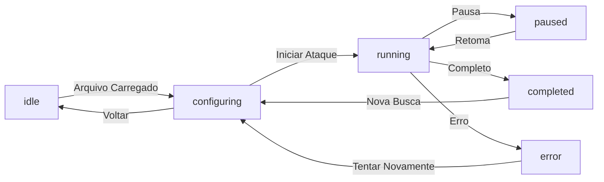

# 🔐 Quebra de Senha - Arquitetura e Design

## 📐 Arquitetura Clean Code + SOLID

Este projeto segue princípios de **Clean Architecture**, **SOLID** e **DRY** (Don't Repeat Yourself) para garantir código escalável, testável e bem organizado.

### Estrutura de Pastas

```
lib/
├── main.dart                 # Ponto de entrada
├── app/
│   ├── app.dart             # Widget principal (MyApp)
│   └── router.dart          # Roteador baseado em estado
├── core/                    # Código compartilhado (reutilizável em toda app)
│   ├── theme/
│   │   ├── app_colors.dart      # Paleta de cores (Dark Mode)
│   │   ├── app_text_styles.dart # Estilos tipográficos (Inter + JetBrains Mono)
│   │   └── app_theme.dart       # Tema completo (Material 3)
│   ├── utils/
│   │   ├── formatters.dart      # Formatação de números, durações, etc
│   │   └── validators.dart      # Validadores de entrada
│   ├── extensions/
│   │   └── extensions.dart      # Extensões úteis para String, Duration, etc
│   └── domain/
│       └── entities/
│           └── index.dart       # Barrel file
├── features/                 # Features isoladas (cada uma é um módulo)
│   └── password_cracker/
│       ├── domain/
│       │   └── entities/
│       │       └── attack_entities.dart  # Modelos de domínio
│       └── presentation/
│           ├── screens/
│           │   ├── import_file_screen.dart        # Tela 1: Importação
│           │   ├── attack_config_screen.dart      # Tela 2: Configuração
│           │   ├── attack_execution_screen.dart   # Tela 3: Execução
│           │   └── attack_result_screen.dart      # Tela 4: Resultado
│           ├── widgets/
│           │   └── tech_widgets.dart         # Widgets reutilizáveis
│           └── state/
│               └── password_cracker_provider.dart # State (ChangeNotifier)
└── services/
    └── file_service.dart   # Serviço de arquivo (file picker)
```

---

## 🎨 Design System

### Identidade Visual

**Dark Mode Obrigatório** - Essencial para:
- Sensação de "ferramenta técnica"
- Economia de bateria (importante com CPU alta)
- Redução de fadiga ocular

### Paleta de Cores

| Elemento | Cor | Hex |
|----------|-----|-----|
| Fundo | Preto Absoluto | `#121212` |
| Surface | Cinza Chumbo | `#1E1E1E` |
| Primária (CTA) | Rust Orange | `#E57373` |
| Secundária | Matrix Green | `#00E676` |
| Texto | Branco | `#FFFFFF` |
| Texto Secundário | Cinza Claro | `#B0B0B0` |
| Sucesso | Verde | `#4CAF50` |
| Erro | Vermelho | `#F44336` |
| Aviso | Amarelo | `#FFC107` |

### Tipografia

- **UI Geral**: Inter (Google Fonts)
- **Código/Senhas/Hashes**: JetBrains Mono (crucial para diferenciar 0 de O, 1 de l, etc)

---

## 🔄 Fluxo de Estados



---

## 📱 Telas (User Journey)

### Tela 1: Importação (Clean State)
- Ícone grande (🔐)
- Texto descritivo
- Botão FAB "Importar Arquivo"
- Valida extensão e tamanho

### Tela 2: Configuração do Ataque (War Room)
- Header com info do arquivo (nome, tamanho)
- **Estratégia**: Chips para Números/Minúsculas/Maiúsculas/Símbolos
- **Comprimento**: RangeSlider (1-16 caracteres)
- Aviso se > 8 caracteres
- Botão "INICIAR QUEBRA DE SENHA"

### Tela 3: Execução (Feedback Real-Time)
- **Dashboard Performance**: Grandes números
  - Velocidade: "1.500.000 senhas/seg"
  - Tentativas: "45.201.000 testadas"
  - Tempo: "00:04:12" (HH:MM:SS)
- **Console Log**: Terminal style com últimas senhas testadas
- **Indicador**: CircularProgressIndicator indeterminado (pulsando)

### Tela 4: Resultado
- **Sucesso**: 🔓 Ícone, senha em CodeDisplay (mono), botões "Copiar" + "Nova Busca"
- **Falha**: 🔒 Ícone, mensagem de erro, botões "Tentar Novamente" + "Novo Arquivo"

---

## 🏗️ Princípios Aplicados

### SOLID

1. **S - Single Responsibility**: Cada classe/widget tem uma responsabilidade única
   - `FileService`: apenas operações de arquivo
   - `PasswordCrackerProvider`: apenas estado
   - `PrimaryActionButton`: apenas um botão primário

2. **O - Open/Closed**: Aberto para extensão, fechado para modificação
   - `TechCard`: pode receber qualquer `child` widget
   - `StatCard`: suporta ícone/cor customizável

3. **L - Liskov Substitution**: Subtypes podem ser substituídas
   - `PrimaryActionButton`, `SecondaryButton` implementam interface similar

4. **I - Interface Segregation**: Classes não dependem de interfaces grandes
   - `AppFormatters` é uma coleção de funções estáticas simples
   - `AppValidators` não depende de UI

5. **D - Dependency Inversion**: Depender de abstrações, não implementações
   - `PasswordCrackerProvider` gerencia estado
   - Screens consomem via Provider (não instanciam diretamente)

### DRY (Don't Repeat Yourself)

- **Widgets reutilizáveis**: `PrimaryActionButton`, `TechCard`, `StatCard`
- **Formatadores centralizados**: `AppFormatters` para números, durações, etc
- **Validadores centralizados**: `AppValidators` para arquivo, config, etc
- **Extensões**: Métodos em `String`, `Duration`, `int` para operações comuns

### Clean Code

- **Nomes descritivos**: `PasswordCrackerProvider`, `AttackExecutionScreen`
- **Funções pequenas**: Cada método tem responsabilidade clara
- **Sem hardcodes**: Constantes em `AppColors`, `AppTextStyles`
- **Organização clara**: core → features → screens/widgets
- **Comentários úteis**: Apenas onde lógica não é óbvia

---

## 📦 Dependências

| Pacote | Propósito |
|--------|-----------|
| `provider` | State Management (ChangeNotifier) |
| `google_fonts` | Tipografia (Inter, JetBrains Mono) |
| `file_picker` | Seletor de arquivo nativo |
| `path_provider` | Acesso a diretórios do sistema |
| `intl` | Formatação de números intl |
| `gap` | Widget de espaçamento (alternativa a SizedBox) |
| `percent_indicator` | Indicadores de progresso customizados |

---

## 🚀 Como Usar

### Consumindo State

```dart
// Ler estado
context.watch<PasswordCrackerProvider>().loadedFile

// Modificar estado
context.read<PasswordCrackerProvider>().setLoadedFile(file)

// Consumer pattern (mais eficiente)
Consumer<PasswordCrackerProvider>(
  builder: (context, provider, _) {
    return Text(provider.loadedFile?.name ?? 'Nenhum arquivo');
  },
)
```

### Adicionando Nova Tela

1. Criar `lib/features/password_cracker/presentation/screens/nova_screen.dart`
2. Estender `StatelessWidget` ou `StatefulWidget`
3. Usar `AppColors`, `AppTextStyles`, e widgets tecados
4. Atualizar `AppRouter` com nova lógica de roteamento

### Adicionando Novo Widget

1. Criar em `lib/features/password_cracker/presentation/widgets/`
2. Seguir padrão de nomeação: `<Descricao>Widget`
3. Aceitar props customizáveis (cores, ações, etc)
4. Usar `TechCard` como base para consistência

---

## 🔧 Próximas Melhorias

- [ ] Integrar com Rust via FFI (atualmente simulado)
- [ ] Persistência de configurações (SharedPreferences)
- [ ] Testes unitários para `AppFormatters`, `AppValidators`
- [ ] Testes de widget para screens
- [ ] Logging estruturado
- [ ] Animações mais elaboradas
- [ ] Suporte a múltiplos idiomas (i18n)
- [ ] Migrar para Riverpod (se necessário escalabilidade)

---

## 📚 Recursos

- [Clean Architecture](https://blog.cleancoder.com/uncle-bob/2012/08/13/the-clean-architecture.html)
- [SOLID Principles](https://en.wikipedia.org/wiki/SOLID)
- [Flutter Best Practices](https://flutter.dev/docs/testing/best-practices)
- [Material Design 3](https://m3.material.io/)

---

**Desenvolvido com ❤️ e ☕ + Rust**
