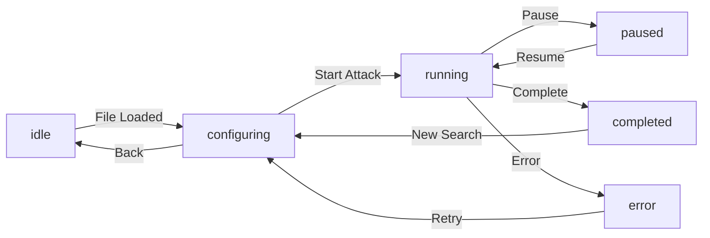

# 🔐 Password Cracking - Architecture and Design

## 📐 Clean Code + SOLID Architecture

This project follows the principles of **Clean Architecture**, **SOLID**, and **DRY** (Don't Repeat Yourself) to ensure scalable, testable, and well-organized code.

### Folder Structure

```
lib/
├── main.dart                 # Entry point
├── app/
│   ├── app.dart             # Main widget (MyApp)
│   └── router.dart          # State-based router
├── core/                    # Shared code (reusable throughout the app)
│   ├── theme/
│   │   ├── app_colors.dart      # Color palette (Dark Mode)
│   │   ├── app_text_styles.dart # Typography styles (Inter + JetBrains Mono)
│   │   └── app_theme.dart       # Complete theme (Material 3)
│   ├── utils/
│   │   ├── formatters.dart      # Number formatting, durations, etc
│   │   └── validators.dart      # Input validators
│   ├── extensions/
│   │   └── extensions.dart      # Useful extensions for String, Duration, etc
│   └── domain/
│       └── entities/
│           └── index.dart       # Barrel file
├── features/                 # Isolated features (each is a module)
│   └── password_cracker/
│       ├── domain/
│       │   └── entities/
│       │       └── attack_entities.dart  # Domain models
│       └── presentation/
│           ├── screens/
│           │   ├── import_file_screen.dart        # Screen 1: Import
│           │   ├── attack_config_screen.dart      # Screen 2: Configuration
│           │   ├── attack_execution_screen.dart   # Screen 3: Execution
│           │   └── attack_result_screen.dart      # Screen 4: Result
│           ├── widgets/
│           │   └── tech_widgets.dart         # Reusable widgets
│           └── state/
│               └── password_cracker_provider.dart # State (ChangeNotifier)
└── services/
    └── file_service.dart   # File service (file picker)
```

---

## 🎨 Design System

### Visual Identity

**Mandatory Dark Mode** - Essential for:
- "Technical tool" feel
- Battery savings (important with high CPU usage)
- Reduced eye strain

### Color Palette

| Element | Color | Hex |
|---------|-------|-----|
| Background | Absolute Black | `#121212` |
| Surface | Lead Gray | `#1E1E1E` |
| Primary (CTA) | Rust Orange | `#E57373` |
| Secondary | Matrix Green | `#00E676` |
| Text | White | `#FFFFFF` |
| Secondary Text | Light Gray | `#B0B0B0` |
| Success | Green | `#4CAF50` |
| Error | Red | `#F44336` |
| Warning | Yellow | `#FFC107` |

### Typography

- **General UI**: Inter (Google Fonts)
- **Code/Passwords/Hashes**: JetBrains Mono (crucial for distinguishing 0 from O, 1 from l, etc)

---

## 🔄 State Flow



---

## 📱 Screens (User Journey)

### Screen 1: Import (Clean State)
- Large icon (🔐)
- Descriptive text
- FAB Button "Import File"
- Validates extension and size

### Screen 2: Attack Configuration (War Room)
- Header with file info (name, size)
- **Strategy**: Chips for Numbers/Lowercase/Uppercase/Symbols
- **Length**: RangeSlider (1-16 characters)
- Warning if > 8 characters
- Button "START PASSWORD CRACKING"

### Screen 3: Execution (Real-Time Feedback)
- **Performance Dashboard**: Large numbers
  - Speed: "1,500,000 passwords/sec"
  - Attempts: "45,201,000 tested"
  - Time: "00:04:12" (HH:MM:SS)
- **Console Log**: Terminal style with latest tested passwords
- **Indicator**: Indeterminate CircularProgressIndicator (pulsing)

### Screen 4: Result
- **Success**: 🔓 Icon, password in CodeDisplay (mono), buttons "Copy" + "New Search"
- **Failure**: 🔒 Icon, error message, buttons "Retry" + "New File"

---

## 🏗️ Applied Principles

### SOLID

1. **S - Single Responsibility**: Each class/widget has a single responsibility
   - `FileService`: file operations only
   - `PasswordCrackerProvider`: state management only
   - `PrimaryActionButton`: primary button only

2. **O - Open/Closed**: Open for extension, closed for modification
   - `TechCard`: can receive any `child` widget
   - `StatCard`: supports customizable icon/color

3. **L - Liskov Substitution**: Subtypes can be substituted
   - `PrimaryActionButton`, `SecondaryButton` implement similar interface

4. **I - Interface Segregation**: Classes don't depend on large interfaces
   - `AppFormatters` is a collection of simple static functions
   - `AppValidators` doesn't depend on UI

5. **D - Dependency Inversion**: Depend on abstractions, not implementations
   - `PasswordCrackerProvider` manages state
   - Screens consume via Provider (don't instantiate directly)

### DRY (Don't Repeat Yourself)

- **Reusable widgets**: `PrimaryActionButton`, `TechCard`, `StatCard`
- **Centralized formatters**: `AppFormatters` for numbers, durations, etc
- **Centralized validators**: `AppValidators` for file, config, etc
- **Extensions**: Methods on `String`, `Duration`, `int` for common operations

### Clean Code

- **Descriptive names**: `PasswordCrackerProvider`, `AttackExecutionScreen`
- **Small functions**: Each method has clear responsibility
- **No hardcodes**: Constants in `AppColors`, `AppTextStyles`
- **Clear organization**: core → features → screens/widgets
- **Useful comments**: Only where logic isn't obvious

---

## 📦 Dependencies

| Package | Purpose |
|---------|---------|
| `provider` | State Management (ChangeNotifier) |
| `google_fonts` | Typography (Inter, JetBrains Mono) |
| `file_picker` | Native file selector |
| `path_provider` | System directory access |
| `intl` | Number formatting |
| `gap` | Spacing widget (alternative to SizedBox) |
| `percent_indicator` | Custom progress indicators |

---

## 🚀 How to Use

### Consuming State

```dart
// Read state
context.watch<PasswordCrackerProvider>().loadedFile

// Modify state
context.read<PasswordCrackerProvider>().setLoadedFile(file)

// Consumer pattern (more efficient)
Consumer<PasswordCrackerProvider>(
  builder: (context, provider, _) {
    return Text(provider.loadedFile?.name ?? 'No file');
  },
)
```

### Adding a New Screen

1. Create `lib/features/password_cracker/presentation/screens/new_screen.dart`
2. Extend `StatelessWidget` or `StatefulWidget`
3. Use `AppColors`, `AppTextStyles`, and tech widgets
4. Update `AppRouter` with new routing logic

### Adding a New Widget

1. Create in `lib/features/password_cracker/presentation/widgets/`
2. Follow naming pattern: `<Description>Widget`
3. Accept customizable props (colors, actions, etc)
4. Use `TechCard` as base for consistency

---

## � Rust Password Cracker Module

### Core Algorithm: `password_cracker.rs`

Implements a password cracking system in three phases:

#### Phase 1: Fast Validation (Fast Path)
- Uses ZipCrypto algorithm for 12-byte header validation
- Calculates encryption keys and verifies check byte
- ~1/256 false positive rate
- **Speed**: ~1 million tests per second
- **Zero allocations**: Pre-computed CRC32 table

#### Phase 2: Complete Verification (Full Verification)
- Decompresses ZIP file with candidate password
- Verifies CRC32 integrity of content
- Eliminates false positives from fast path
- **Cost**: ~100x slower than fast path, but rare

#### Phase 3: Parallelization (Rayon)
- **Dictionary attack**: Processes 1MB chunks in parallel
- **Brute force**: Generates and tests passwords in 65K chunks per thread
- **Work stealing**: Rayon auto-balances across cores
- **Atomic locks**: Relaxed ordering to minimize contention

### Data Structures

```rust
// Attack configuration
struct CrackConfig {
    min_length: usize,
    max_length: usize,
    use_lowercase: bool,
    use_uppercase: bool,
    use_numbers: bool,
    use_symbols: bool,
    use_dictionary: bool,
    custom_words: Vec<String>,
}

// Real-time progress
struct CrackProgress {
    attempts: u64,              // Total attempts
    current_password: String,   // Last tested password
    elapsed_seconds: u64,       // Elapsed time
    passwords_per_second: f64,  // Speed
    phase: String,              // "Dictionary", "Running", "Done", "Error"
}

// Efficient charset storage
struct CharacterSet {
    data: [u8; 94],  // Fixed-size, stack-allocated
    len: usize,      // Current number of chars
}
```

### Control Features

**Global Pause/Resume**:
```rust
static PAUSE_FLAG: OnceLock<Arc<AtomicBool>> = OnceLock::new();

pub fn set_pause(paused: bool) {
    get_pause_flag().store(paused, Ordering::Relaxed);
}

fn wait_if_paused() {
    // Check every 50ms without blocking threads
    while pause_flag.load(Ordering::Relaxed) {
        sleep(50ms);
    }
}
```

### Real-Time Progress
- Separate thread for reporting (doesn't block workers)
- Updates UI every 500ms
- Dynamically calculates speed (passwords/second)

---

## 🧠 Design Decisions

### Why Rust?
- **Critical performance**: 20-50K+ passwords/second vs ~1-5K in Dart/Flutter
- **Memory control**: Zero allocations in hot paths
- **Parallelization**: Rayon automatic across cores without GC pauses
- **Optimized CRC32**: Inlining = ~1M ops/sec per thread

### Why Rayon?
- **Data parallelism**: Automatic `par_iter()`
- **Work stealing**: Dynamically balances across cores
- **Zero unsafe**: Safe by default
- **Scope threads**: Deadlock-free synchronization

### Two-Phase Validation
- **Fast path (~1/256)**: Rejects 99.6% quickly
- **Full path**: Decompresses only for few finalists
- **Gain**: ~100x faster than decompressing everything

---

## 🔧 Next Improvements

- [ ] AES-256 support (not just ZipCrypto)
- [ ] GPU acceleration (Metal/Vulkan)
- [ ] Custom wordlist upload
- [ ] Batch processing
- [ ] Attack session persistence
- [ ] Unit tests (AppFormatters, AppValidators)
- [ ] Widget tests
- [ ] Structured logging
- [ ] i18n support
- [ ] Elaborate animations

---

## 📚 Resources

- [Clean Architecture](https://blog.cleancoder.com/uncle-bob/2012/08/13/the-clean-architecture.html)
- [SOLID Principles](https://en.wikipedia.org/wiki/SOLID)
- [Flutter Best Practices](https://flutter.dev/docs/testing/best-practices)
- [Material Design 3](https://m3.material.io/)
- [ZipCrypto Specification](https://en.wikipedia.org/wiki/Zip_(file_format)#Encryption)
- [Rayon Documentation](https://docs.rs/rayon/)

---

**Developed with ❤️ and ☕ + Rust**
